# Fir Framework Architecture

This document provides a comprehensive overview of the Fir framework's architecture, components, and data flow patterns based on the actual codebase implementation.

## Overview

Fir is a Go web framework that enables building reactive web applications using server-rendered HTML with progressive enhancement. It combines Go's `html/template` with Alpine.js for client-side interactivity, supporting both traditional HTTP forms and real-time WebSocket communication.

### Component Interaction Overview

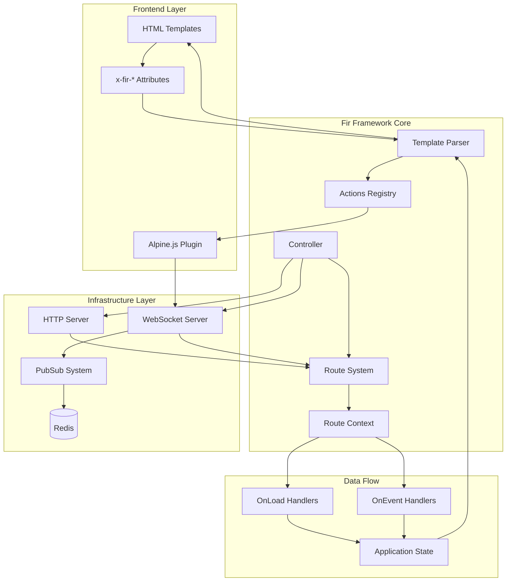

## Core Architecture

### Dual-Mode Operation

Fir operates in two distinct modes that provide progressive enhancement:

1. **HTTP Mode (Fallback)**: Traditional form submissions with full page reloads
2. **WebSocket Mode (Enhanced)**: Real-time DOM updates via Alpine.js without page reloads

Both modes use identical server-side code and `x-fir-*` attributes, ensuring consistent behavior regardless of client capabilities.

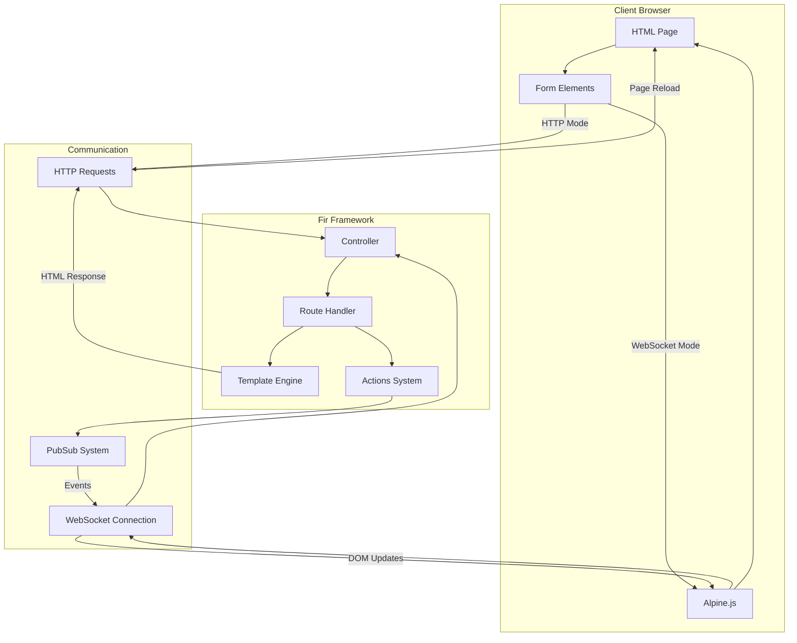

## Core Components

### 1. Controller System

**File**: `controller.go`

The `Controller` is the main entry point that manages routes and provides configuration options.

```go
type Controller struct {
    name     string
    pubsub   pubsub.Adapter
    // ... other fields
}

// Key Functions:
func NewController(name string, options ...ControllerOption) *Controller
func (c *Controller) RouteFunc(routeOpts RouteOptions) http.HandlerFunc
```

**Controller Options**:

- `WithPubsubAdapter(adapter pubsub.Adapter)`: Set custom PubSub implementation
- `WithChannelFunc(fn ChannelFunc)`: Define channel routing logic
- `WithErrorHandler(fn ErrorHandlerFunc)`: Custom error handling
- `DevelopmentMode(enable bool)`: Enable development features

### 2. Route System

**Files**: `route.go`, `route_context.go`, `route_options.go`

Routes define the application logic and are configured using functional options:

```go
type RouteOptions struct {
    ID           func() string
    Content      func() string
    OnLoad       func() OnLoadFunc
    OnEvent      func() map[string]OnEventFunc
    // ... other options
}

// Core route functions:
func ID(id string) RouteOption
func Content(contentPath string) RouteOption
func OnLoad(fn OnLoadFunc) RouteOption
func OnEvent(eventID string, fn OnEventFunc) RouteOption
```

### 3. Route Context

**File**: `route_context.go`

The `RouteContext` provides the interface for handlers to interact with the framework:

```go
type RouteContext struct {
    route    *route
    request  *http.Request
    response http.ResponseWriter
    // ... other fields
}

// Key Methods:
func (ctx *RouteContext) Data(data map[string]interface{}) error
func (ctx *RouteContext) KV(key string, value interface{}) error
func (ctx *RouteContext) FieldError(field string, err error) error
func (ctx *RouteContext) Bind(dst interface{}) error
func (ctx *RouteContext) Redirect(url string) error
```

### 4. Template Processing System

**Files**: `parse.go`, `internal/template/`

Fir extends Go's `html/template` with custom processing for `x-fir-*` attributes:

1. **Template Parsing**: Standard Go template parsing with custom functions
2. **Attribute Processing**: `x-fir-*` attributes are parsed and converted to Alpine.js event handlers
3. **Block Extraction**: Template blocks are identified for dynamic content updates

```go
func parseTemplate(opt routeOpt) (*template.Template, eventTemplates, error)
func processRenderAttributes(content []byte) ([]byte, error)
```

### 5. Actions System

**Files**: `internal/actions/`

The actions system defines how `x-fir-*` attributes translate to DOM operations:

```go
type ActionHandler interface {
    Process(actionInfo ActionInfo, actionsMap map[string]string, targetSelector string) (string, error)
}

// Action Registry:
var registry = map[string]ActionHandler{
    "refresh":         &RefreshActionHandler{},
    "reset":           &ResetActionHandler{},
    "remove":          &RemoveActionHandler{},
    "remove-parent":   &RemoveParentActionHandler{},
    "append":          &AppendActionHandler{},
    "prepend":         &PrependActionHandler{},
    "toggle-disabled": &ToggleDisabledActionHandler{},
    "toggleClass":     &ToggleClassActionHandler{},
    "dispatch":        &DispatchActionHandler{},
    "runjs":           &TriggerActionHandler{},
    "js":              &ActionPrefixHandler{},
    "redirect":        &RedirectActionHandler{},
}
```

### 6. PubSub System

**Files**: `pubsub/pubsub.go`

The PubSub system enables real-time communication between server and clients:

```go
type Adapter interface {
    Publish(ctx context.Context, channel string, event Event) error
    Subscribe(ctx context.Context, channel string) (<-chan Event, error)
    Close() error
}

type Event struct {
    ID        string            `json:"id"`
    Params    map[string]string `json:"params"`
    SessionID string            `json:"session_id"`
    IsForm    bool              `json:"is_form"`
}
```

### 7. WebSocket System

**File**: `websocket.go`

Handles WebSocket connections and real-time event processing:

```go
func (rt *route) onWebsocket(ctx context.Context, conn *websocket.Conn, request *http.Request)
func renderAndWriteEventWS(send chan []byte, channel string, ctx RouteContext, pubsubEvent pubsub.Event) error
```

## Data Flow Architecture

### System Overview

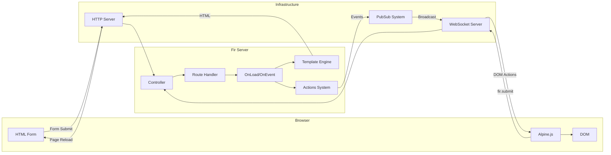

### 1. Initial Page Load

```text
Browser Request → Controller.RouteFunc() → route.ServeHTTP() → OnLoad handler → Template rendering → HTML response
```

1. **Request Routing**: Controller routes request to appropriate route handler
2. **OnLoad Execution**: Route's OnLoad function provides initial data via `ctx.Data()`
3. **Template Rendering**: Go template renders with provided data
4. **Attribute Processing**: `x-fir-*` attributes converted to Alpine.js handlers
5. **Response**: Complete HTML page sent to browser

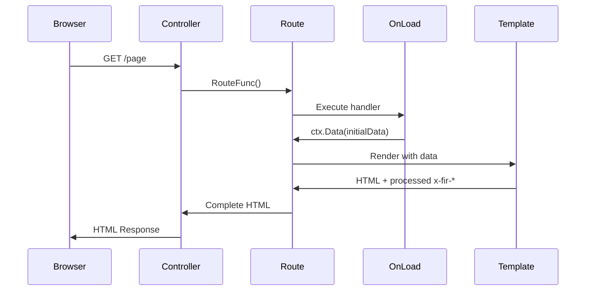

### 2. HTTP Mode Event Flow

```text
Form Submit → route.ServeHTTP() → OnEvent handler → Template re-render → Full page reload
```

1. **Form Submission**: Traditional POST with `formaction="/?event=<event-name>"`
2. **Event Processing**: Route's OnEvent function processes request
3. **State Update**: Handler updates server state, returns data via `ctx.KV()`
4. **Event Publishing**: Events published via `writeAndPublishEvents()`
5. **Page Re-render**: Complete page re-rendered with updated state
6. **Full Reload**: Browser receives new HTML content

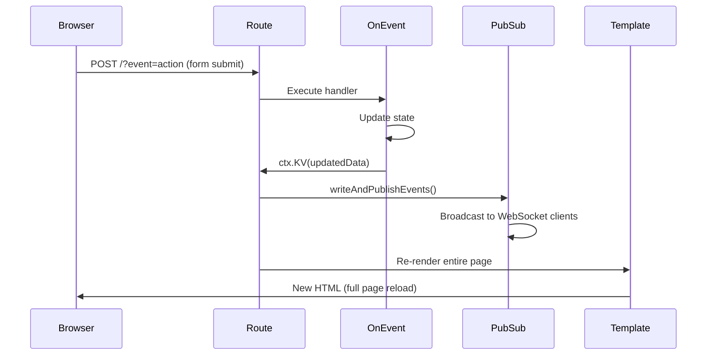

### 3. WebSocket Mode Event Flow

```text
Alpine.js Submit → WebSocket → OnEvent handler → Event publishing → DOM actions → Client updates
```

1. **Client Event**: Alpine.js `$fir.submit()` sends event via WebSocket
2. **Event Processing**: Same OnEvent function processes WebSocket message
3. **State Update**: Handler updates server state, returns data via `ctx.KV()`
4. **Event Publishing**: Events published via `publishEvents()`
5. **DOM Actions**: Alpine.js receives events and executes DOM actions
6. **Targeted Updates**: Only specific DOM elements updated without reload

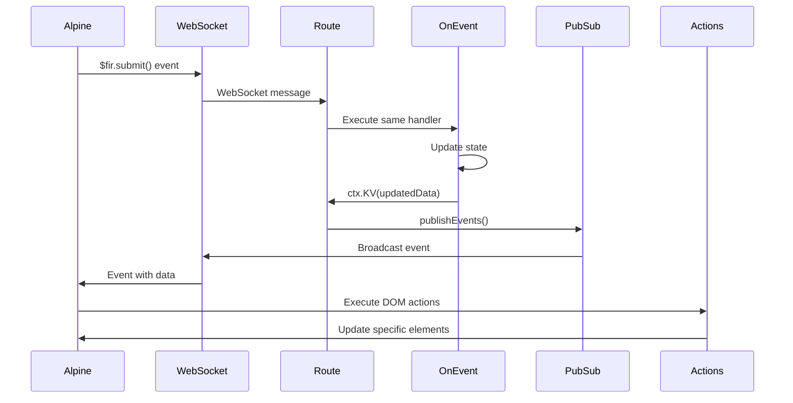

### 4. Event Publishing Flow

```go
// Event Publisher Pattern
type eventPublisher func(event pubsub.Event) error

// HTTP Mode
func writeAndPublishEvents(ctx RouteContext) eventPublisher {
    return func(pubsubEvent pubsub.Event) error {
        // Publish to WebSocket subscribers
        ctx.route.pubsub.Publish(ctx.request.Context(), channel, pubsubEvent)
        // Write JSON response for HTTP client
        return writeEventHTTP(ctx, pubsubEvent)
    }
}

// WebSocket Mode
func publishEvents(ctx context.Context, eventCtx RouteContext, channel string) eventPublisher {
    return func(pubsubEvent pubsub.Event) error {
        return eventCtx.route.pubsub.Publish(ctx, channel, pubsubEvent)
    }
}
```

## Template System Architecture

### Template Processing Pipeline

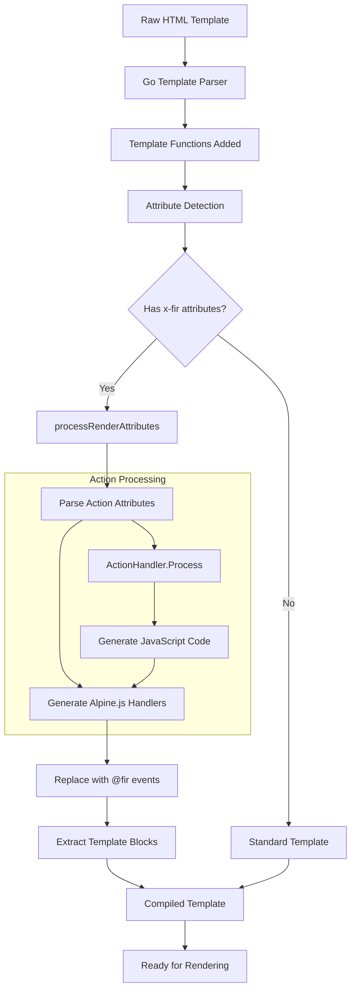

### 1. Template Structure

Templates use standard Go `html/template` syntax with Fir extensions:

```html
Templates use standard Go `html/template` syntax with Fir extensions:

```html
<!DOCTYPE html>
<html>
<head>
    <!-- Alpine.js and Fir plugin -->
    <script defer src="https://unpkg.com/@livefir/fir@latest/dist/fir.min.js"></script>
    <script defer src="https://unpkg.com/alpinejs@3.x.x/dist/cdn.min.js"></script>
</head>
<body>
    <div x-data>
        <!-- Progressive enhancement forms -->
        <form method="post" @submit.prevent="$fir.submit()">
            <button formaction="/?event=add-item" type="submit" 
                    x-fir-append:item="add-item">Add Item</button>
        </form>
        
        <!-- Dynamic content with template blocks -->
        <ul id="items-list" x-fir-append:item="add-item">
            {{ range .items }}
                {{ block "item" . }}
                    <li>{{ . }}</li>
                {{ end }}
            {{ end }}
        </ul>
    </div>
</body>
</html>
```

### 2. Attribute Processing Pipeline

```text
x-fir-* attributes → ActionHandler.Process() → Alpine.js @fir:event handlers → DOM actions
```

Example transformation:

```html
<!-- Input -->
<button x-fir-refresh="update:ok">Update</button>

<!-- Output -->
<button @fir:update:ok="$fir.refreshEl()">Update</button>
```

### 3. Template Block System

Template blocks enable partial content updates:

```html
<!-- Block definition -->
{{ block "item" . }}
    <li class="item">{{ .Name }}</li>
{{ end }}

<!-- Alpine.js receives rendered block for DOM insertion -->
```

### Actions System Flow

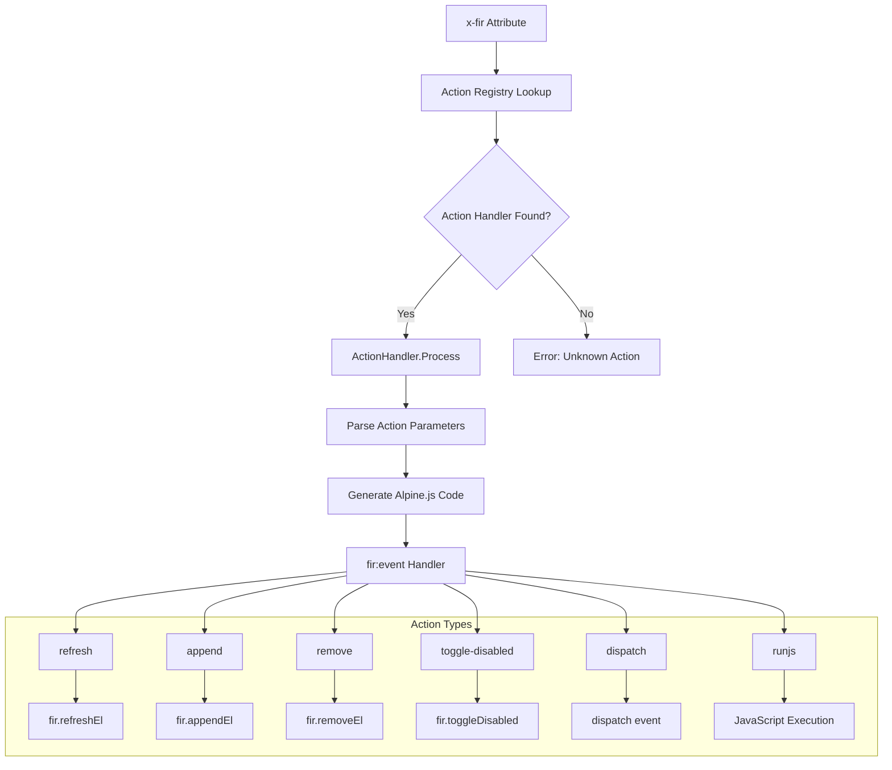

## State Management Architecture

### State Flow Diagram

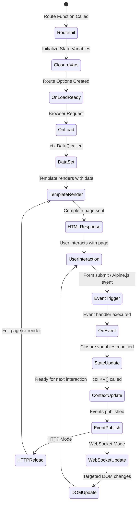

### 1. Server-Side State

State is managed through closure variables in route functions:

```go
func MyRoute() fir.RouteOptions {
    // Persistent state (survives requests)
    var items []Item
    var counter int
    
    return fir.RouteOptions{
        fir.OnLoad(func(ctx fir.RouteContext) error {
            // Initial data load
            return ctx.Data(map[string]interface{}{
                "items":   items,
                "counter": counter,
            })
        }),
        
        fir.OnEvent("add-item", func(ctx fir.RouteContext) error {
            // Update persistent state
            items = append(items, newItem)
            // Return updated data
            return ctx.KV("items", items)
        }),
    }
}
```

### 2. Context Data Methods

- **`ctx.Data(map[string]interface{})`**: Used in OnLoad for initial page data
- **`ctx.KV(key, value)`**: Used in OnEvent for incremental updates
- **`ctx.FieldError(field, error)`**: Used for validation errors
- **`ctx.Bind(dst)`**: Used for form data binding
- **`ctx.Redirect(url)`**: Used for navigation

### 3. Event Handling Pattern

```go
func handleOnEventResult(err error, ctx RouteContext, publish eventPublisher) *pubsub.Event {
    if err != nil {
        // Handle field errors, redirects, etc.
        return handleError(err, ctx)
    }
    
    // Create success event from route data
    event := pubsub.Event{
        ID:        eventID,
        Params:    ctx.routeData.data,
        SessionID: sessionID,
        IsForm:    isFormSubmission,
    }
    
    // Publish event to subscribers
    publish(event)
    return &event
}
```

## Security Architecture

### 1. Input Validation

All user input must be validated in event handlers:

```go
fir.OnEvent("create-item", func(ctx fir.RouteContext) error {
    name := ctx.Request().FormValue("name")
    if name == "" {
        return ctx.FieldError("name", errors.New("name is required"))
    }
    // Process validated input...
})
```

### 2. Template Security

- **XSS Protection**: Go's `html/template` provides automatic escaping
- **CSRF Protection**: Implemented at the application level
- **Input Sanitization**: Required in all event handlers

### 3. WebSocket Security

- **Authentication**: Handled through session management
- **Channel Authorization**: Controlled via `ChannelFunc`
- **Message Validation**: All WebSocket messages validated server-side

## Development Patterns

### 1. Progressive Enhancement

1. **Start with HTTP**: Ensure functionality works without JavaScript
2. **Add Alpine.js**: Enhance with `@submit.prevent="$fir.submit()"`
3. **Include x-fir-***: Define DOM update behavior
4. **Test Both Modes**: Verify HTTP fallback and WebSocket enhancement

### 2. Error Handling

```go
// Field-specific errors
return ctx.FieldError("email", errors.New("invalid email format"))

// General errors trigger 500 response
return fmt.Errorf("database connection failed: %w", err)

// Redirects
return ctx.Redirect("/login")
```

### 3. Real-time Broadcasting

Events are automatically broadcast to all connected WebSocket clients on the same channel:

```go
fir.OnEvent("broadcast-update", func(ctx fir.RouteContext) error {
    // Update triggers broadcast to all clients
    return ctx.KV("data", updatedData)
})
```

## Testing Architecture

### Testing Strategy Overview

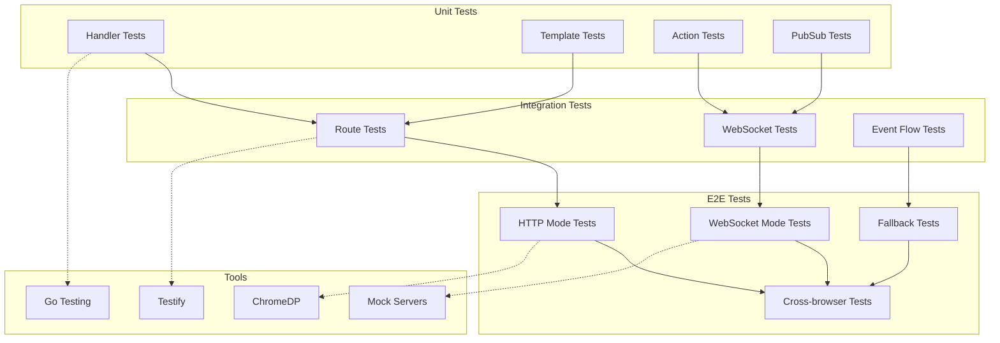

### 1. Unit Testing

- **Handler Testing**: Test individual OnLoad/OnEvent functions
- **Template Testing**: Test template rendering with mock data
- **Action Testing**: Test x-fir-* attribute processing

### 2. Integration Testing

- **Route Testing**: Test complete request/response cycles
- **WebSocket Testing**: Test real-time event flow
- **PubSub Testing**: Test event publishing and subscription

### 3. End-to-End Testing

Using ChromeDP for comprehensive testing of both modes:

```go
func TestActionsE2E(t *testing.T) {
    t.Run("HTTPMode", func(t *testing.T) {
        // Test traditional form submissions
    })
    
    t.Run("WebSocketMode", func(t *testing.T) {
        // Wait for WebSocket connection
        chromedp.Poll(`window.$fir && window.$fir.ws && window.$fir.ws.readyState === 1`, nil)
        // Test real-time updates
    })
}
```

## Performance Considerations

### 1. Server-Side

- **State Management**: Closure variables are memory-efficient for route-specific state
- **Template Caching**: Templates are parsed once and cached
- **Event Publishing**: Asynchronous broadcasting to WebSocket clients
- **Connection Pooling**: WebSocket connections managed efficiently

### 2. Client-Side

- **Bundle Size**: Fir Alpine.js plugin is lightweight (~15KB)
- **DOM Operations**: Actions minimize DOM manipulation
- **Event Batching**: Multiple actions can be batched in single events
- **Progressive Loading**: JavaScript enhancement is optional

### 3. Network Efficiency

- **WebSocket Mode**: Eliminates full page reloads
- **Targeted Updates**: Only changed content transmitted
- **Event Compression**: JSON events are compact
- **HTTP Fallback**: Ensures accessibility when WebSocket unavailable

## Deployment Architecture

### Deployment Modes

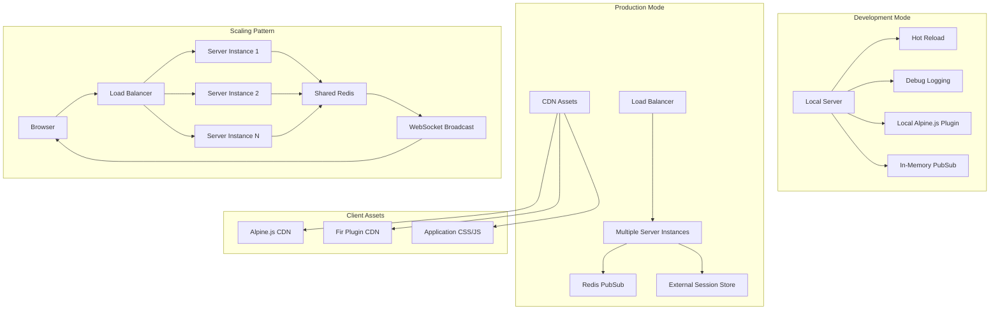

### 1. Development Mode

```go
controller := fir.NewController("app", fir.DevelopmentMode(true))
```

Enables:

- Detailed logging
- Template reloading
- Client-side development tools
- Local Alpine.js plugin serving

### 2. Production Mode

```go
controller := fir.NewController("app",
    fir.WithPubsubAdapter(redisPubsub),
    fir.WithChannelFunc(authChannelFunc),
)
```

Features:

- Redis PubSub for horizontal scaling
- Custom authentication/authorization
- Optimized template serving
- CDN-served client assets

### 3. Scaling Considerations

- **Horizontal Scaling**: Multiple server instances with shared Redis PubSub
- **Session Management**: External session store for multi-instance deployment
- **Load Balancing**: WebSocket-aware load balancer configuration
- **State Management**: Externalize state for stateless server instances

This architecture enables Fir to provide a modern, reactive web development experience while maintaining simplicity and web standards compliance.
