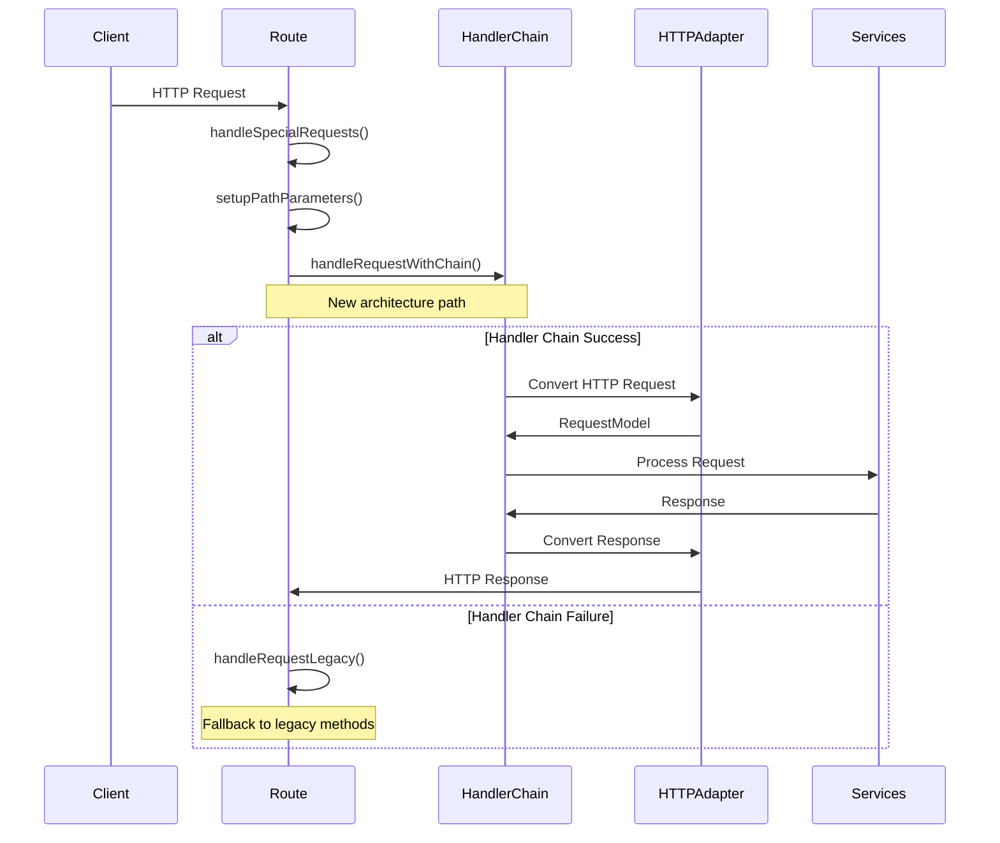
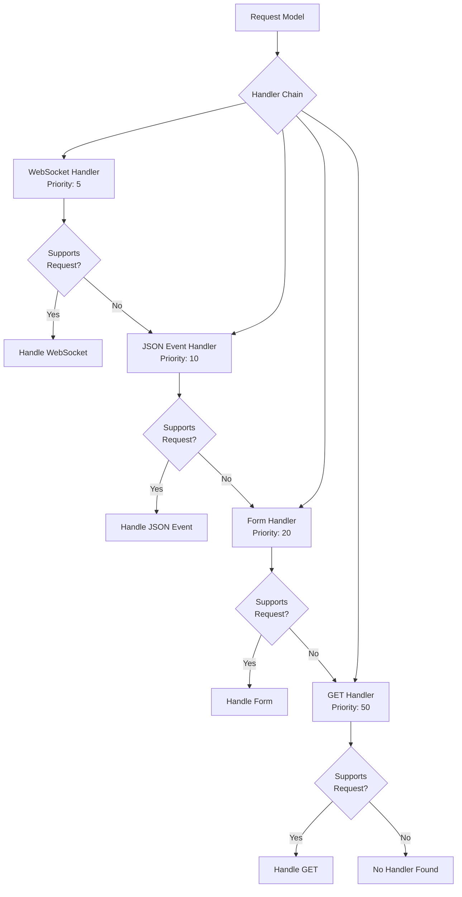

# Request Handling Flow Documentation

This document explains the new request handling flow in the Fir framework after the service layer refactoring.

## Overview

The Fir framework now uses a layered architecture with clear separation of concerns:

```
HTTP Request → Route → Handler Chain → Services → Domain Logic
```

## Request Flow Sequence

### 1. Initial Request Reception



### 2. Handler Chain Processing

The handler chain uses a priority-based routing system:



## Handler Implementations

### WebSocket Handler

**Supports**: WebSocket upgrade requests

```go
func (h *WebSocketHandler) SupportsRequest(req *RequestModel) bool {
    return websocket.IsWebSocketUpgrade(req.Context)
}

func (h *WebSocketHandler) Handle(ctx context.Context, req *RequestModel) (*ResponseModel, error) {
    // 1. Upgrade connection to WebSocket
    // 2. Start message loop
    // 3. Handle incoming events via EventService
    // 4. Broadcast responses via PubSub
}
```

**Flow**:
1. Validates WebSocket upgrade headers
2. Upgrades HTTP connection to WebSocket
3. Starts bidirectional message handling
4. Processes events through EventService
5. Publishes results via PubSub system

### JSON Event Handler

**Supports**: POST requests with JSON content type containing events

```go
func (h *JSONEventHandler) SupportsRequest(req *RequestModel) bool {
    return req.Method == "POST" && 
           strings.Contains(req.Header.Get("Content-Type"), "application/json") &&
           h.hasEventData(req)
}

func (h *JSONEventHandler) Handle(ctx context.Context, req *RequestModel) (*ResponseModel, error) {
    // 1. Parse JSON event data
    // 2. Process event via EventService
    // 3. Render response via RenderService
    // 4. Build HTTP response via ResponseBuilder
}
```

**Flow**:
1. Parses JSON payload for event data
2. Validates event structure and parameters
3. Processes event through EventService
4. Renders any template updates via RenderService
5. Constructs JSON response with DOM updates

### Form Handler  

**Supports**: POST requests with form data containing events

```go
func (h *FormHandler) SupportsRequest(req *RequestModel) bool {
    return req.Method == "POST" && 
           strings.Contains(req.Header.Get("Content-Type"), "application/x-www-form-urlencoded") &&
           h.hasEventData(req)
}

func (h *FormHandler) Handle(ctx context.Context, req *RequestModel) (*ResponseModel, error) {
    // 1. Parse form data
    // 2. Process event via EventService  
    // 3. Handle success/error scenarios
    // 4. Render response or redirect
}
```

**Flow**:
1. Parses form data for event information
2. Processes event through EventService
3. Handles different result types (data, errors, redirects)
4. Either renders template with data or redirects on success

### GET Handler

**Supports**: GET requests for template rendering

```go
func (h *GetHandler) SupportsRequest(req *RequestModel) bool {
    return req.Method == "GET"
}

func (h *GetHandler) Handle(ctx context.Context, req *RequestModel) (*ResponseModel, error) {
    // 1. Process onLoad event if present
    // 2. Render template via RenderService
    // 3. Build HTML response
}
```

**Flow**:
1. Checks for and processes onLoad events
2. Renders main template via RenderService
3. Constructs HTML response for browser

## Service Layer Integration

### Event Service

Handles all event processing logic:

```go
type EventService interface {
    ProcessEvent(ctx context.Context, req EventRequest) (*EventResponse, error)
}
```

**Responsibilities**:
- Event validation
- Handler registry lookup
- Event execution
- Error handling and transformation
- Metrics collection

### Render Service

Manages template rendering:

```go
type RenderService interface {
    RenderTemplate(ctx RenderContext) (*RenderResult, error)
    RenderError(ctx ErrorContext) (*RenderResult, error)
    RenderEvents(events []pubsub.Event) ([]DOMEvent, error)
}
```

**Responsibilities**:
- Template loading and caching
- Template execution with data
- Error template rendering
- DOM event extraction

### Response Builder

Constructs HTTP responses:

```go
type ResponseBuilder interface {
    BuildEventResponse(result *EventResponse, request *RequestModel) (*ResponseModel, error)
    BuildTemplateResponse(render *RenderResult) (*ResponseModel, error)
    BuildErrorResponse(err error, code int) (*ResponseModel, error)
}
```

**Responsibilities**:
- HTTP response construction
- Content-Type header setting
- Status code determination
- Error response formatting

## HTTP Abstraction Layer

### Request Model

Transport-agnostic request representation:

```go
type RequestModel struct {
    Method      string
    URL         *url.URL
    Header      http.Header
    Body        io.ReadCloser
    Form        url.Values
    PostForm    url.Values
    QueryParams url.Values
    PathParams  map[string]string
    Context     context.Context
    
    // Fir-specific fields
    EventID     string
    EventTarget string
    SessionID   string
    ElementKey  string
}
```

### Response Model

Transport-agnostic response representation:

```go
type ResponseModel struct {
    StatusCode int
    Headers    map[string]string
    Body       []byte
    Events     []DOMEvent
    Redirect   *RedirectInfo
}
```

## Legacy Fallback Mechanism

The route maintains backward compatibility through a fallback system:

```go
func (rt *route) ServeHTTP(w http.ResponseWriter, r *http.Request) {
    // ... setup code ...
    
    // Try new handler chain first
    err := rt.handleRequestWithChain(w, r)
    if err != nil {
        // Fallback to legacy methods
        rt.handleRequestLegacy(w, r)
    }
}

func (rt *route) handleRequestLegacy(w http.ResponseWriter, r *http.Request) {
    // Route to appropriate legacy handler
    if websocket.IsWebSocketUpgrade(r) {
        rt.handleWebSocketUpgrade(w, r)
    } else if rt.isJSONEventRequest(r) {
        rt.handleJSONEvent(w, r)
    } else if r.Method == http.MethodPost {
        rt.handleFormPost(w, r)
    } else if r.Method == http.MethodGet {
        rt.handleGetRequest(w, r)
    }
}
```

This ensures:
- Zero regression during transition
- Gradual migration capability
- Robust error handling
- Production safety

## Configuration and Dependency Injection

Routes use a factory pattern for service creation:

```go
type RouteServiceFactory struct {
    services *routeservices.RouteServices
}

func (f *RouteServiceFactory) CreateHandlerChain() handlers.HandlerChain {
    return handlers.SetupDefaultHandlerChain(f.services)
}
```

The factory creates properly configured handler chains with all necessary services injected.

## Error Handling

Each layer has specific error handling responsibilities:

1. **Handler Layer**: Request validation, basic error responses
2. **Service Layer**: Business logic errors, validation errors
3. **Route Layer**: Fallback error handling, HTTP error responses

Errors flow upward and are transformed at each layer to provide appropriate responses to clients.

## Performance Considerations

The new architecture includes several performance optimizations:

- **Handler Selection**: Priority-based routing avoids unnecessary checks
- **Service Caching**: Template and service result caching
- **Lazy Loading**: Services created only when needed
- **Request Pooling**: RequestModel reuse where possible

## Migration Path

The architecture supports gradual migration:

1. **Phase 1**: Handler chain runs alongside legacy methods (current)
2. **Phase 2**: Handler chain becomes primary with legacy fallback
3. **Phase 3**: Legacy methods removed once handler chain proven stable

This ensures production stability throughout the architectural transition.
