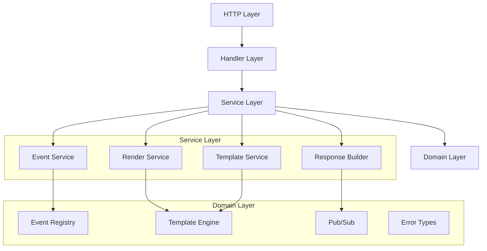

# Service Layer Documentation

This document details the service layer interfaces and implementations in the Fir framework.

## Overview

The service layer provides business logic abstraction from HTTP transport concerns, enabling:

- **Testability**: Services can be unit tested with mocks
- **Reusability**: Business logic independent of HTTP transport
- **Maintainability**: Clear separation of concerns
- **Extensibility**: Easy to add new services or modify existing ones

## Architecture



## Core Service Interfaces

### EventService

Handles event processing logic extracted from route handlers.

```go
type EventService interface {
    ProcessEvent(ctx context.Context, req EventRequest) (*EventResponse, error)
}

type EventRequest struct {
    ID           string
    Target       *string
    ElementKey   *string
    SessionID    string
    Context      context.Context
    Params       map[string]interface{}
    RequestModel *firHttp.RequestModel
}

type EventResponse struct {
    StatusCode   int
    Headers      map[string]string
    Body         []byte
    Events       []firHttp.DOMEvent
    Redirect     *firHttp.RedirectInfo
    PubSubEvents []pubsub.Event
    Errors       map[string]interface{}
}
```

**Implementation**:

```go
type DefaultEventService struct {
    registry  EventRegistry
    validator EventValidator
    publisher EventPublisher
    logger    EventLogger
    metrics   *eventMetrics
}

func (s *DefaultEventService) ProcessEvent(ctx context.Context, req EventRequest) (*EventResponse, error) {
    // 1. Validate event request
    if err := s.validator.ValidateEvent(req); err != nil {
        return nil, fmt.Errorf("event validation failed: %w", err)
    }
    
    // 2. Look up event handler
    handler, found := s.registry.Get(req.RouteID, req.ID)
    if !found {
        return nil, fmt.Errorf("event handler not found: %s", req.ID)
    }
    
    // 3. Execute event handler
    result := s.executeHandler(ctx, handler, req)
    
    // 4. Process result and generate response
    return s.processHandlerResult(ctx, result, req)
}
```

**Responsibilities**:

- Event validation and parameter checking
- Event handler registry lookup
- Event execution with proper context
- Error handling and transformation
- Result processing and response generation
- Metrics collection and logging

### RenderService

Manages template rendering and DOM event generation.

```go
type RenderService interface {
    RenderTemplate(ctx RenderContext) (*RenderResult, error)
    RenderError(ctx ErrorContext) (*RenderResult, error)
    RenderEvents(events []pubsub.Event) ([]DOMEvent, error)
}

type RenderContext struct {
    RouteID      string
    Data         interface{}
    IsError      bool
    TemplateType TemplateType
    Route        RouteInfo
}

type RenderResult struct {
    HTML   []byte
    Events []DOMEvent
}
```

**Implementation**:

```go
type DefaultRenderService struct {
    templateService TemplateService
    renderer        Renderer
    logger          RenderLogger
}

func (s *DefaultRenderService) RenderTemplate(ctx RenderContext) (*RenderResult, error) {
    // 1. Load appropriate template
    template, err := s.templateService.LoadTemplate(ctx.TemplateConfig())
    if err != nil {
        return nil, fmt.Errorf("template loading failed: %w", err)
    }
    
    // 2. Render template with data
    html, err := s.renderer.RenderTemplate(template, ctx.Data)
    if err != nil {
        return nil, fmt.Errorf("template rendering failed: %w", err)
    }
    
    // 3. Extract DOM events
    events, err := s.renderer.ExtractDOMEvents(html)
    if err != nil {
        return nil, fmt.Errorf("DOM event extraction failed: %w", err)
    }
    
    return &RenderResult{
        HTML:   html,
        Events: events,
    }, nil
}
```

**Responsibilities**:

- Template loading and caching coordination
- Template rendering with data binding
- Error template rendering
- DOM event extraction from rendered HTML
- Event template processing

### TemplateService

Provides template management and caching functionality.

```go
type TemplateService interface {
    LoadTemplate(config TemplateConfig) (*template.Template, error)
    RenderTemplate(tmpl *template.Template, data interface{}) ([]byte, error)
    ParseTemplate(content string, config TemplateConfig) (*template.Template, error)
    ClearCache(routeID string) error
}

type TemplateConfig struct {
    RouteID       string
    Layout        string
    Content       string
    Partials      []string
    FuncMap       template.FuncMap
    CacheDisabled bool
}
```

**Implementation**:

```go
type DefaultTemplateService struct {
    engine    TemplateEngine
    cache     TemplateCache
    funcMap   template.FuncMap
    logger    TemplateLogger
}

func (s *DefaultTemplateService) LoadTemplate(config TemplateConfig) (*template.Template, error) {
    // 1. Check cache first
    if !config.CacheDisabled {
        if cached := s.cache.Get(config.CacheKey()); cached != nil {
            return cached, nil
        }
    }
    
    // 2. Parse template from files
    tmpl, err := s.parseTemplateFiles(config)
    if err != nil {
        return nil, err
    }
    
    // 3. Cache if enabled
    if !config.CacheDisabled {
        s.cache.Set(config.CacheKey(), tmpl)
    }
    
    return tmpl, nil
}
```

**Responsibilities**:

- Template file loading and parsing
- Template caching and cache management
- Function map management
- Template engine abstraction
- Template validation

### ResponseBuilder

Constructs HTTP responses from service layer results.

```go
type ResponseBuilder interface {
    BuildEventResponse(result *EventResponse, request *RequestModel) (*ResponseModel, error)
    BuildTemplateResponse(render *RenderResult) (*ResponseModel, error)
    BuildErrorResponse(err error, code int) (*ResponseModel, error)
    BuildRedirectResponse(url string, code int) (*ResponseModel, error)
}
```

**Implementation**:

```go
type DefaultResponseBuilder struct {
    logger ResponseLogger
}

func (b *DefaultResponseBuilder) BuildEventResponse(result *EventResponse, request *RequestModel) (*ResponseModel, error) {
    response := &ResponseModel{
        StatusCode: result.StatusCode,
        Headers:    make(map[string]string),
    }
    
    // Set content type based on request
    if b.isJSONRequest(request) {
        response.Headers["Content-Type"] = "application/json"
        response.Body = b.buildJSONEventResponse(result)
    } else {
        response.Headers["Content-Type"] = "text/html"
        response.Body = result.Body
    }
    
    // Add custom headers
    for k, v := range result.Headers {
        response.Headers[k] = v
    }
    
    return response, nil
}
```

**Responsibilities**:

- HTTP response model construction
- Content-Type header determination
- Status code setting
- Header management
- Response body formatting

## Service Integration

### RouteServices Container

The `RouteServices` struct acts as a dependency injection container:

```go
type RouteServices struct {
    EventService    EventService
    RenderService   RenderService
    TemplateService TemplateService
    ResponseBuilder ResponseBuilder
    
    // Legacy components
    EventRegistry   EventRegistry
    Renderer        Renderer
    TemplateEngine  TemplateEngine
    PubSub          pubsub.Adapter
    
    // Configuration
    Options         RouteOptions
    PathParamsFunc  func(*http.Request) map[string]string
    ChannelFunc     func(*http.Request, string) *string
}
```

### Service Factory

The `RouteServiceFactory` creates configured services:

```go
type RouteServiceFactory struct {
    services *routeservices.RouteServices
}

func (f *RouteServiceFactory) CreateEventService() services.EventService {
    return f.services.EventService
}

func (f *RouteServiceFactory) CreateRenderService() services.RenderService {
    return f.services.RenderService
}

func (f *RouteServiceFactory) CreateHandlerChain() handlers.HandlerChain {
    return handlers.SetupDefaultHandlerChain(f.services)
}
```

## Service Configuration

### Event Service Configuration

```go
type EventServiceConfig struct {
    ValidatorEnabled bool
    MetricsEnabled   bool
    LoggingEnabled   bool
    MaxEventSize     int
    TimeoutDuration  time.Duration
}

func NewEventServiceWithConfig(registry EventRegistry, config EventServiceConfig) EventService {
    service := &DefaultEventService{
        registry: registry,
    }
    
    if config.ValidatorEnabled {
        service.validator = NewDefaultEventValidator()
    }
    
    if config.MetricsEnabled {
        service.metrics = NewEventMetrics()
    }
    
    return service
}
```

### Render Service Configuration

```go
type RenderServiceConfig struct {
    CacheEnabled     bool
    CacheSize        int
    ErrorTemplates   map[int]string  // Status code -> template path
    DefaultLayout    string
    PartialPaths     []string
}
```

## Error Handling

Services use structured error handling:

```go
type ServiceError struct {
    Type    ErrorType
    Code    string
    Message string
    Cause   error
    Context map[string]interface{}
}

type ErrorType int

const (
    ValidationError ErrorType = iota
    NotFoundError
    PermissionError
    InternalError
    TimeoutError
)

func (e *ServiceError) Error() string {
    return fmt.Sprintf("[%s] %s: %s", e.Code, e.Type, e.Message)
}
```

### Error Transformation

Services transform domain errors into appropriate HTTP responses:

```go
func (b *DefaultResponseBuilder) BuildErrorResponse(err error, fallbackCode int) (*ResponseModel, error) {
    var serviceErr *ServiceError
    if errors.As(err, &serviceErr) {
        return &ResponseModel{
            StatusCode: b.errorTypeToHTTPCode(serviceErr.Type),
            Body:       []byte(serviceErr.Message),
            Headers:    map[string]string{"Content-Type": "text/plain"},
        }, nil
    }
    
    // Fallback for unknown errors
    return &ResponseModel{
        StatusCode: fallbackCode,
        Body:       []byte("Internal server error"),
        Headers:    map[string]string{"Content-Type": "text/plain"},
    }, nil
}
```

## Testing Services

Services are designed for easy unit testing:

```go
func TestEventService_ProcessEvent(t *testing.T) {
    // Create mocks
    mockRegistry := NewMockEventRegistry()
    mockValidator := NewMockEventValidator()
    
    // Setup service
    service := NewDefaultEventService(mockRegistry, mockValidator, nil, nil, nil)
    
    // Setup expectations
    mockValidator.EXPECT().ValidateEvent(gomock.Any()).Return(nil)
    mockRegistry.EXPECT().Get("route1", "click").Return(mockHandler, true)
    
    // Execute test
    req := EventRequest{ID: "click", RouteID: "route1"}
    response, err := service.ProcessEvent(context.Background(), req)
    
    // Verify results
    assert.NoError(t, err)
    assert.Equal(t, 200, response.StatusCode)
}
```

## Performance Considerations

### Caching Strategy

Services implement multiple caching layers:

- **Template Service**: Template parsing and compilation cache
- **Render Service**: Rendered template fragment cache
- **Event Service**: Event handler lookup cache

### Resource Pooling

Services use object pooling for frequently allocated objects:

```go
var requestPool = sync.Pool{
    New: func() interface{} {
        return &EventRequest{}
    },
}

func (s *DefaultEventService) ProcessEvent(ctx context.Context, req EventRequest) (*EventResponse, error) {
    // Use pooled objects for internal processing
    processingReq := requestPool.Get().(*EventRequest)
    defer requestPool.Put(processingReq)
    
    // ... processing logic
}
```

### Async Processing

Some services support asynchronous processing for better performance:

```go
func (s *DefaultEventService) ProcessEventAsync(ctx context.Context, req EventRequest) <-chan EventResult {
    resultChan := make(chan EventResult, 1)
    
    go func() {
        defer close(resultChan)
        response, err := s.ProcessEvent(ctx, req)
        resultChan <- EventResult{Response: response, Error: err}
    }()
    
    return resultChan
}
```

## Migration from Legacy Code

The service layer maintains compatibility with existing code:

### Legacy Adapter

```go
type LegacyEventAdapter struct {
    eventService EventService
}

func (a *LegacyEventAdapter) HandleEvent(ctx RouteContext) error {
    // Convert RouteContext to EventRequest
    req := a.convertRouteContextToEventRequest(ctx)
    
    // Process through new service
    response, err := a.eventService.ProcessEvent(ctx.request.Context(), req)
    if err != nil {
        return err
    }
    
    // Convert response back to legacy format
    return a.writeResponseToRouteContext(ctx, response)
}
```

### Gradual Migration

Services can be introduced incrementally:

1. **Phase 1**: Services run alongside legacy code
2. **Phase 2**: New features use services only
3. **Phase 3**: Legacy code migrated to services
4. **Phase 4**: Legacy code removed

This ensures production stability during the architectural transition.
